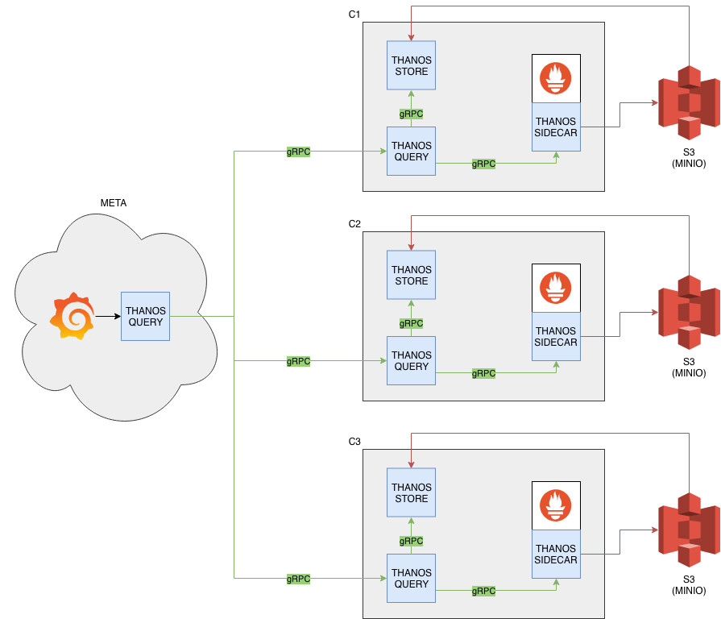

# Thanos experiment

This experiment spins up 3 independent Prometheus instances together with 3 Thaons-sidecars. On kubernetes this would be best within the same Pod.
Additionally a Thanos-store and a Thanos-query for each Prometheus instance is configured as well.

Finally a "meta"-Thanos-query is configured to provide a "fleet-wide" view over all instances.

For "long-term"-storage there are also minio instances, which are configured through ```creds/c[1|2|3].s3.yaml``` for the Thanos-sidecars and Thanos-stores, mimicking dediacted S3 storage.

## Storage options

Storage in Google GCS is prepared. Uncomment the environment variable ```GOOGLE_APPLICATION_CREDENTIALS``` in the file ```docker-compose.yaml``` and configure ```creds/gcs-credentials.json.sample``` and ```creds/gcs.yaml.sample``` accordingly.

You can also change ```creds/c[1|2|3]-s3.yaml``` to match your Amazon S3 configuration. See <https://github.com/improbable-eng/> for details.

## Diagram



[Draw.io source](Thanos_Architecture.xml)

## Starting the experiment

```
make
docker-compose up
```

## Accessing the components

Access minio store in your browser via <http://127.0.0.1:19010/minio/> <http://127.0.0.1:19020/minio/> <http://127.0.0.1:19030/minio/>using the credentials ```THANOS:ITSTHANOSTIME```.

The independent Prometheus instances are accessible via <http://127.0.0.1:19011> <http://127.0.0.1:19021> <http://127.0.0.1:19031>.

The Thanos-query instances are accessible via <http://127.0.0.1:19013> <http://127.0.0.1:19023> <http://127.0.0.1:19033> and the meta-instance via <http://127.0.0.1:19043>.

## Stopping the experiment

```
docker-compose down -v
```
